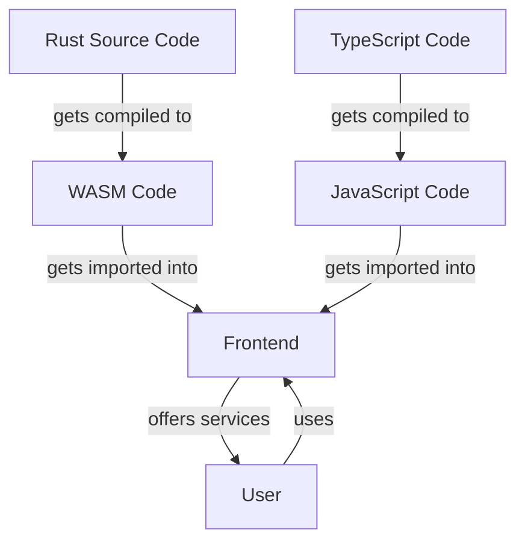

# Implementation of the A\*-algorithm

---
layout: center
class: "text-justify"
---

- **Graph search algorithm**, finding a path between start and target node
- Finds optimal solution
- Improved version of the **Dijkstra Algorithm**, that uses a heuristic value
to improve the search speed by directing the search more towards the target node
- One of the most famous applications of the A\*-algorithm is **Google Maps**
- a common heuristic for path finding in the real world is the air-line distance between two targets
- The heuristic value ("assumed cost") must never be higher than the actual cost to
 traverse from start to target node

---
layout: center
class: "text-justify"
---

The requirement was to implement the algorithm in a language of choice and be able to
explain the implementation. This implementation goes a few steps further and also includes
a frontend written in [TypeScript](https://typescriptlang.org) with the [Vue Framework](https://vuejs.org).
The goal was to research and test today's possibilities of embedding a browser-foreign language
(anything that isn't JavaScript) into a web application via the upcoming technology of
[WebAssembly](https://webassembly.org/) (short: WASM).
One of the languages with the strongest WASM support right now is [Rust](https://rust-lang.org).
It is a systems programming language who's speed is mostly on par with C while offering many
modern language features (composition, iterators, modules, integrated package management and much more).
It supports compiling programs both to machine code (x86, ARM, RISC-V) as well as WebAssembly.
It's strongest argument is memory safety thanks to a clever compiler mechanism called
the Borrow Checker, that makes sure the user handles memory ownership correctly. This
eliminates a whole class of errors (use after free, unfreed memory, double freeing, etc.).
All these checks happen at compile-time, resulting in no overhead for the running program. 
Its adoption is growing fast. For example, it became the second language to be allowed
for Linux kernel development (next to C).[^1] Google is allowing it for extension development
of the Chromium Codebase,[^2] as well as for Android core development.[^3]

[^1]: [Rust in the Linux Kernel](https://thenewstack.io/rust-in-the-linux-kernel/)
[^2]: [Rust for Chromium](https://security.googleblog.com/2023/01/supporting-use-of-rust-in-chromium.html)
[^3]: [Rust for Android](https://security.googleblog.com/2021/04/rust-in-android-platform.html)

---
---

## Application structure

